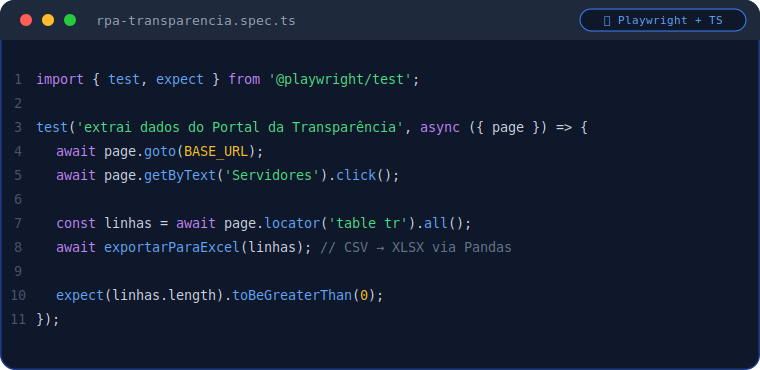

  

 

## 🧑‍💻 Sobre mim

Desenvolvedor Fullstack baseado em **Campos dos Goytacazes - RJ**, atualmente na **Cia do Crédito**. Trabalho no dia a dia com **Node.js, TypeScript e Angular**, com experiência que vai desde **APIs com arquitetura de microsserviços** até **automação RPA** com Playwright para extração e tratamento de dados.

Gosto de resolver problemas reais com código limpo, testável e pensado para escalar — sempre evoluindo o stack com o que há de mais moderno em JavaScript/TypeScript.

- 🔭 Focado atualmente em **microsserviços, automação e dashboards de dados**
- 🌱 Aprimorando conhecimentos em **Next.js, Docker e observabilidade (Prometheus/Grafana)**
- 📫 Contato: [LinkedIn](https://www.linkedin.com/in/caua-mendonca) · [devcauamartello@gmail.com](mailto:devcauamartello@gmail.com) · [Portfólio](https://portfolio-dev-xi-puce.vercel.app/)

 

## 🎭 Especialidade: Test Automation & RPA com Playwright

Construo soluções de automação de ponta a ponta — não só testes, mas **bots de RPA que rodam em produção**, extraindo e processando dados reais:

- 🤖 **Web scraping / RPA** de portais públicos, com scripts resilientes a mudanças de layout
- ✅ **Testes E2E** com Playwright + TypeScript, usando fixtures, page objects e relatórios de execução
- 🔄 **Pipelines de dados**: conversão automática de CSV → XLSX via Python/Pandas
- 🧠 Seletores estáveis, tratamento de erros e logs claros para depuração rápida

 

 

<a href="https://github.com/caua-mendonca/playwright-rpa-transparencia">▶ Ver projeto completo: playwright-rpa-transparencia</a>

 

## 🛠️ Stack técnica

<table>
<tr>
<td valign="top" width="20%"><strong>Linguagens</strong></td>
<td>

</td>
</tr>
<tr>
<td valign="top"><strong>Frontend</strong></td>
<td>

</td>
</tr>
<tr>
<td valign="top"><strong>Backend</strong></td>
<td>

</td>
</tr>
<tr>
<td valign="top"><strong>DevOps & Automação</strong></td>
<td>

</td>
</tr>
</table>

 

## 🚀 Projetos em destaque

<table>
<tr>
<td width="50%">

</td>
<td width="50%">

</td>
</tr>
<tr>
<td width="50%">

</td>
<td width="50%">

</td>
</tr>
</table>

 

## 📊 Estatísticas

<table>
<tr>
<td>

</td>
<td>

</td>
</tr>
</table>

 

 

## 📈 Atividade recente

<picture>
  <source media="(prefers-color-scheme: dark)" srcset="https://raw.githubusercontent.com/caua-mendonca/caua-mendonca/output/github-contribution-grid-snake-dark.svg">
  <source media="(prefers-color-scheme: light)" srcset="https://raw.githubusercontent.com/caua-mendonca/caua-mendonca/output/github-contribution-grid-snake.svg">
  
</picture>

  

